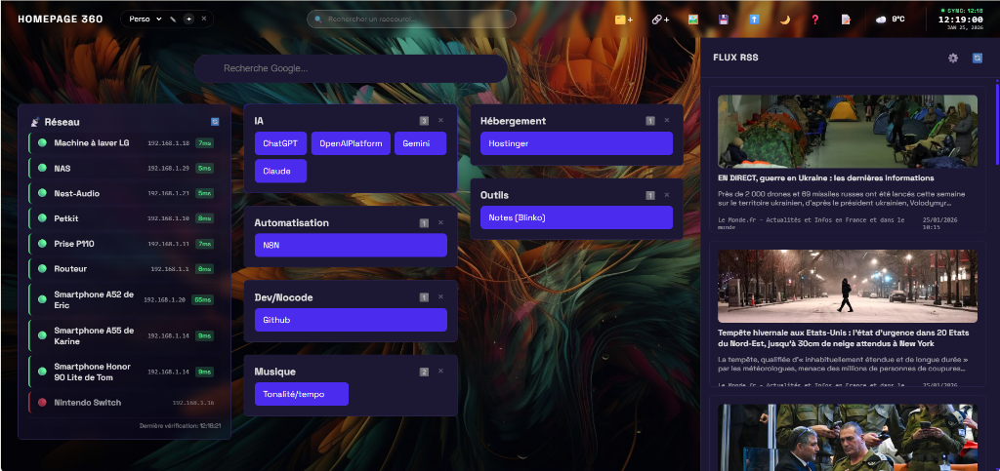

# Homepage 360 🚀

**Homepage 360** est un tableau de bord personnel moderne, modulaire et entièrement personnalisable, conçu pour centraliser vos raccourcis, vos flux d'actualités et vos outils du quotidien dans une interface élégante et fluide.



## ✨ Caractéristiques

### 🧩 Interface Modulaire
- Organisez vos raccourcis par **zones thématiques**
- **Layouts multi-colonnes** : Affichez vos blocs en 1, 2 ou 3 colonnes par zone (boutons 1️⃣ 2️⃣ 3️⃣)
- **Drag & Drop** : Réorganisez vos blocs et zones par simple glisser-déposer (SortableJS)
- **Couleurs personnalisables** : Définissez une couleur unique pour chaque bloc

### 📡 Monitoring Réseau (Nouveau !)
- **Widget de statut réseau** : Surveillez vos appareils en temps réel
- **Agent de monitoring** : Déployez un agent Docker sur votre réseau local
- **Indicateurs visuels** : � En ligne / 🔴 Hors ligne avec latence
- **Rafraîchissement automatique** toutes les 30 secondes

### 📰 Flux RSS Intégrés
- Agrégation de vos sites préférés
- **Extraction automatique des images** (Open Graph, thumbnails)
- **Limite configurable** d'articles par flux
- Mise en cache intelligente

### 🌦️ Widgets Intégrés
- **Météo en temps réel** avec détection automatique de position ou sélection manuelle
- **Horloge numérique** avec affichage de la date
- **Recherche Google** intégrée
- **Notes rapides** persistantes (Alt+N)

### 📱 PWA (Progressive Web App)
- Installation sur bureau ou mobile
- Support hors-ligne via Service Worker
- Stratégie de cache "stale-while-revalidate"

### 🎨 Personnalisation Avancée
- Mode Sombre / Clair
- Fonds d'écran personnalisés (URL ou fichier local)
- Design "Glassmorphism" moderne

### 💾 Persistance & Portabilité
- Sauvegarde automatique dans le `localStorage`
- Export et Import de configuration au format JSON
- Gestion de **profils multiples** (Travail, Maison, etc.)

### 🔒 Sécurité (v2.3)
- **Authentification multi-utilisateur** : Protection de l'accès frontend par login/password
- **Sessions sécurisées** : Cookies httpOnly, secure, sameSite avec expiration configurable
- **Brute force protection** : Verrouillage automatique après 5 tentatives (15 min)
- **Signature HMAC** : Intégrité des données garantie par HMAC-SHA256
- **Rotation de clés** : Support multi-clés pour rotation sans interruption
- **Logging structuré** : Logs JSON pour intégration SIEM
- **Protection XSS** : Échappement de toutes les données utilisateur et externes
- **Rate limiting** : Protection contre les abus API
- **Validation des entrées** : Types, longueurs et formats vérifiés

📖 Pour une analyse complète de la sécurité, consultez [SECURITY.md](SECURITY.md).


## 🔐 Configuration de l'authentification

Homepage360 utilise un système d'authentification par cookie pour protéger l'accès à l'interface.

### Configuration initiale

1. **Installez les dépendances** (si pas encore fait) :
   ```bash
   cd server
   npm install
   ```

2. **Créez votre premier utilisateur** :

   Le fichier `server/users.json` est automatiquement créé avec un utilisateur par défaut :
   - **Username** : `admin`
   - **Password** : `admin123`

   ⚠️ **Important** : Changez ce mot de passe en production !

3. **Ajoutez un nouvel utilisateur** (optionnel) :

   Générez un hash bcrypt pour le mot de passe :
   ```bash
   node -e "const bcrypt = require('bcrypt'); bcrypt.hash('VotreMotDePasse', 12).then(h => console.log(h));"
   ```

   Puis ajoutez l'utilisateur dans `server/users.json` :
   ```json
   {
     "users": [
       {
         "username": "votre_username",
         "passwordHash": "$2b$12$...",
         "createdAt": "2026-02-10T00:00:00.000Z"
       }
     ]
   }
   ```

### Fonctionnalités

- **Sessions persistantes** : 24 heures par défaut, 30 jours avec "Remember me"
- **Timeout d'inactivité** : Déconnexion automatique après 4 heures sans activité
- **Protection brute force** : Max 5 tentatives, verrouillage 15 minutes par IP
- **Cookies sécurisés** : httpOnly, secure (HTTPS en prod), sameSite strict

### Reset mot de passe

Pour réinitialiser un mot de passe, générez un nouveau hash et modifiez `server/users.json` :
```bash
node -e "const bcrypt = require('bcrypt'); bcrypt.hash('NouveauMotDePasse', 12).then(h => console.log(h));"
```

## 🐳 Déploiement avec Docker & Traefik

Le projet est pré-configuré pour être déployé derrière un reverse-proxy **Traefik** avec gestion automatique des certificats SSL (Let's Encrypt).

### Pré-requis
- Un réseau Docker nommé `web` : `docker network create web`
- Une **clé API** pour le monitoring réseau (obligatoire)

### Configuration

1. Modifiez `docker-compose.yml` pour remplacer `votre-domaine.com` par votre domaine réel.

2. Générez une clé API sécurisée :
   ```bash
   openssl rand -hex 32
   ```

3. Créez un fichier `.env` à la racine :
   ```env
   MONITOR_API_KEY=votre-clé-générée-ici
   ```

4. **Configurez l'authentification** (voir section ci-dessus)

5. Lancez les conteneurs :
   ```bash
   docker-compose up -d --build
   ```

### Mise à jour
```bash
git pull origin main
docker-compose down && docker-compose up -d --build
```

## 📡 Configuration du Monitoring Réseau

Pour activer le monitoring de vos appareils réseau, consultez [NETWORK_SETUP.md](NETWORK_SETUP.md).

**Résumé rapide :**
1. Déployez l'agent sur votre réseau local (`agent/docker-compose.yml`)
2. Configurez les appareils à surveiller dans `agent/config.json`
3. Utilisez la même clé API que le serveur principal

## 🚀 Installation locale (Développement)

Le projet utilise **Vite** comme serveur de développement.

1. Clonez le dépôt :
   ```bash
   git clone https://github.com/ebrangerieau/homepage360.git
   cd homepage360
   ```

2. Installez les dépendances :
   ```bash
   npm install
   ```

3. Lancez le serveur de développement :
   ```bash
   npm run dev
   ```

4. Ouvrez http://localhost:5173 dans votre navigateur.

## 🛠️ Technologies utilisées

- **Frontend** : HTML5, CSS3 (Vanilla), JavaScript (ES6 Modules)
- **Build** : Vite 5.x
- **Backend** : Node.js + Express (pour le monitoring réseau)
- **Bibliothèques** :
  - [SortableJS](https://sortablejs.github.io/Sortable/) pour le glisser-déposer
- **Stockage** : LocalStorage API
- **PWA** : Service Workers & Web Manifest
- **Conteneurisation** : Docker + Docker Compose

## 📂 Structure du projet

```
homepage360/
├── js/                     # Code source frontend
│   ├── main.js            # Orchestration principale
│   └── modules/           # Modules ES6
│       ├── store.js       # Gestion d'état
│       ├── ui.js          # Utilitaires UI + sécurité
│       ├── rss.js         # Agrégation RSS
│       ├── network.js     # Widget monitoring réseau
│       ├── widgets.js     # Horloge & Météo
│       ├── notes.js       # Notes rapides
│       └── background.js  # Fond personnalisé
├── server/                # Serveur backend (monitoring)
│   └── index.js          # API Express
├── agent/                 # Agent de monitoring réseau
│   ├── agent.js          # Script de ping
│   └── config.example.json
├── index.html            # Point d'entrée
├── style.css             # Styles globaux
├── sw.js                 # Service Worker PWA
├── manifest.json         # Configuration PWA
├── Dockerfile            # Image Docker production
└── docker-compose.yml    # Orchestration Docker
```

## ⌨️ Raccourcis clavier

| Touche | Action |
| :--- | :--- |
| `/` | Rechercher un raccourci |
| `N` | Ajouter un nouveau bloc |
| `Z` | Ajouter une nouvelle zone |
| `T` | Changer le thème (Sombre/Clair) |
| `R` | Rafraîchir les flux RSS |
| `Alt + N` | Afficher/Masquer les notes rapides |
| `H` | Afficher l'aide des raccourcis |
| `Esc` | Fermer les fenêtres modales |

## 📋 Changelog

### v2.3.0 (Février 2026)
- 🔐 **Authentification** : Système de login/password multi-utilisateur
- 🍪 **Sessions sécurisées** : Cookies httpOnly avec expiration et remember me
- 🛡️ **Brute force protection** : Verrouillage automatique après 5 tentatives
- ⏱️ **Timeout inactivité** : Déconnexion automatique après 4h sans activité
- 🚪 **Interface de logout** : Bouton de déconnexion dans l'interface

### v2.2.0 (Janvier 2026)
- 🔏 **Signature HMAC** : Intégrité des payloads avec HMAC-SHA256
- 🔄 **Rotation de clés** : Support multi-clés pour rotation sans interruption
- 📊 **Logging structuré** : Format JSON pour intégration SIEM
- 🛡️ Protection anti-replay avec timestamp

### v2.1.0 (Janvier 2026)
- 🔒 **Sécurité** : Protection XSS, validation des entrées, rate limiting
- 🔑 Clé API obligatoire pour le serveur de monitoring


### v2.0.0 (Janvier 2026)
- 📡 **Monitoring Réseau** : Nouveau widget de surveillance des appareils
- 🔢 **Layouts Multi-colonnes** : Organisation flexible des zones (1-3 colonnes)
- 🏗️ Refactoring complet en modules ES6
- 🖼️ Extraction automatique des images OG pour les flux RSS

### v1.0.0
- 🚀 Version initiale avec zones, blocs, RSS, météo, notes, PWA

---

Développé avec ❤️ pour une productivité à 360°.
